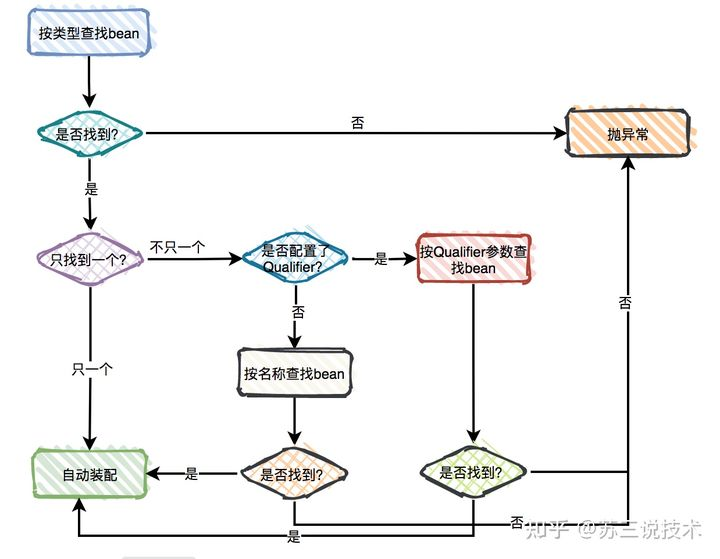

### 存在多个同类型实例时解决方法
IUserService 接口有两个实现类，此时在UserController中自动注入会报错    
因为在默认情况下注入方式是byType，我们使用IUserService接收注入实例时在spring容器中存在多个此类型的实例对象，spring无法确定需要输入哪个实例对象    
解决方法有两个：
 - 一是在要注入的变量上使用@Qualifier注解标识需要的是哪个实例
 - 二是在多个实现类中选择默认注入的实例，然后使用@Primary注解修饰
> 这里如果两个不同的实现类分别配置了 @Qualifier 和 @Primary，则优先使用@Qualifier修饰的实例

### @Autowired的一些其他用法
```
    @Autowired
    private List<IUserService> list;

    @Autowired
    private Map<String, IUserService> map;
```
在上面的代码中，我们使用@Autowired注解修饰了集合类型变量。对于List和Set类型的集合，
spring会根据泛型类将所有匹配的实例全部添加到到集合中，
对于Map类型，会使用beanName为key将实例对象保存在集合中。

### @Autowired的装配顺序



